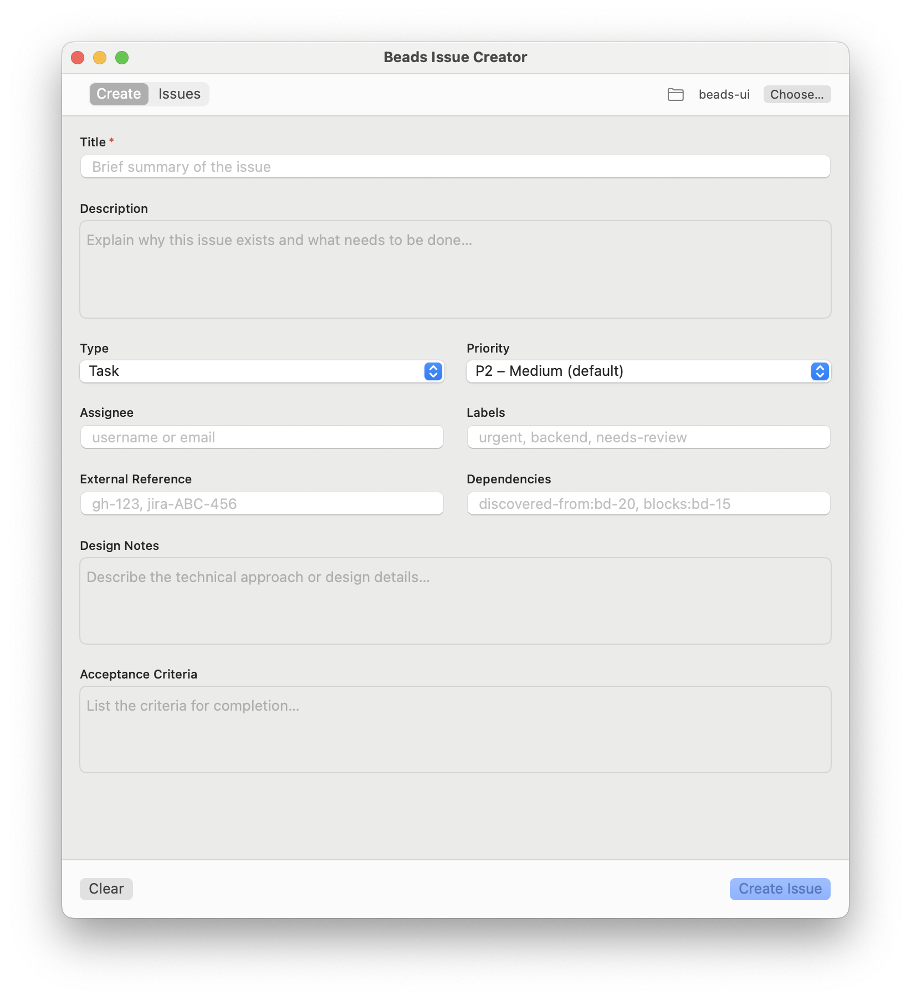
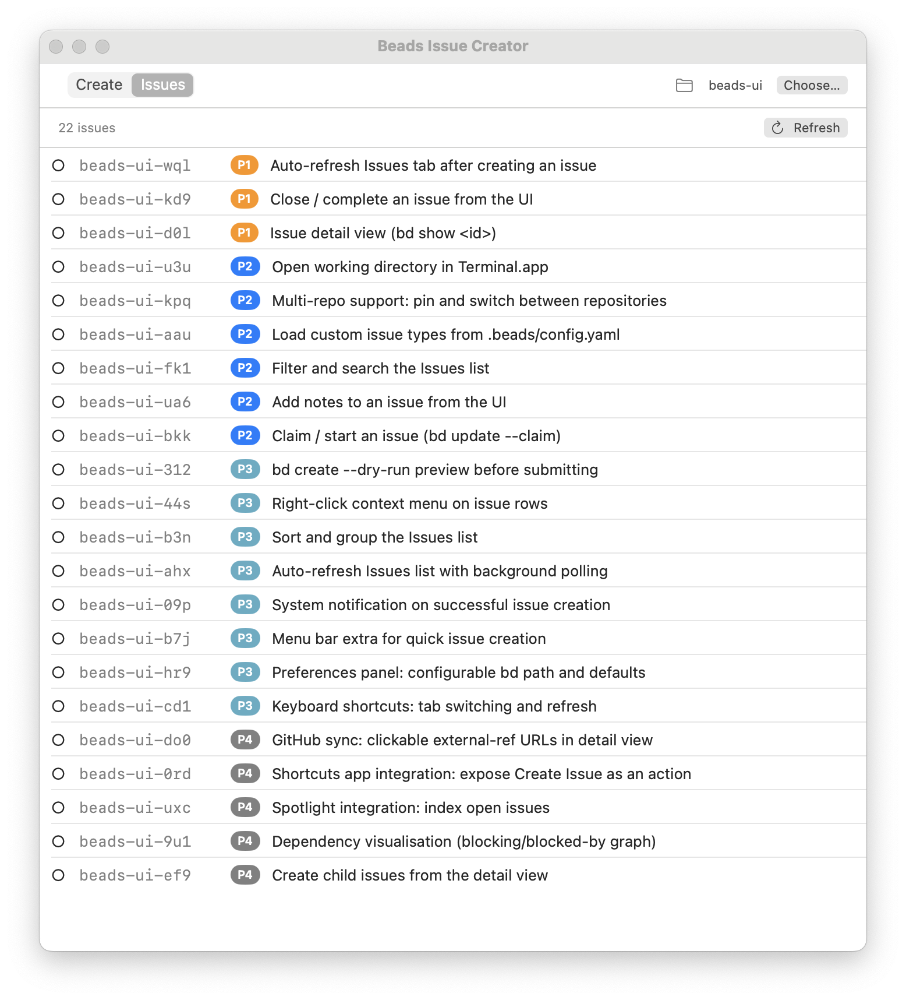

# BeadsUI

A native macOS app for creating and viewing issues in the [beads](https://steveyegge.github.io/beads/) (`bd`) issue tracking system — no CLI required.


---

## Screenshots

<table>
  <tr>
    <td align="center"><strong>Create tab</strong></td>
    <td align="center"><strong>Issues tab</strong></td>
  </tr>
  <tr>
    <td></td>
    <td></td>
  </tr>
</table>

---

## What it does

`bd` is a powerful local-first issue tracker, but its interface is the terminal. BeadsUI wraps the most common workflows in a clean SwiftUI window:

- **Create issues** via a form that mirrors `bd create-form` — title, description, type, priority, assignee, labels, external reference, design notes, acceptance criteria, and dependencies
- **Browse open issues** in a live list with status indicators, priority badges, and one-click ID copying
- **Persistent repo selection** — pick your beads working directory once and it's remembered across launches

---

## Requirements

- macOS 13.0 (Ventura) or later
- Xcode Command Line Tools (`xcode-select --install`)
- [`bd`](https://steveyegge.github.io/beads/getting-started/installation) installed and available in your `PATH`
- A beads-initialised repository (one with a `.beads/` directory)

For the icon pipeline only:

```bash
brew install librsvg   # provides rsvg-convert
```

---

## Build & run

```bash
# Clone or download this repo, then:
cd beads-ui

make          # compiles BeadsUI.swift → BeadsUI.app
make run      # compiles + opens the app
make clean    # removes BeadsUI.app
```

The `Makefile` auto-detects your CPU architecture (`arm64` on Apple Silicon, `x86_64` on Intel) so no configuration is needed.

### Building the icon (optional)

```bash
make icon     # SVG → .icns  (requires librsvg)
make          # rebuilds the app and bundles the icon
```

If the Dock doesn't pick up the new icon immediately:

```bash
killall Dock
```

---

## Usage

### Selecting a repository

Click **Choose…** in the top bar and navigate to any directory that contains a `.beads/` folder. The selection persists between launches.

### Creating an issue


Switch to the **Create** tab. Fill in at minimum the **Title** field (marked `*`), then press **Create Issue** or hit `⌘↵`.

On success, a green banner appears showing the new issue ID (e.g. `bd-abc`). Click **Copy ID** to put it on the clipboard. The form clears automatically, ready for the next issue.

Field reference:

| Field | `bd create` flag | Notes |
|---|---|---|
| Title | `--title` | Required |
| Description | `--description` | Multi-line |
| Type | `--type` | task / bug / feature / epic / chore |
| Priority | `--priority` | P0 (critical) → P4 (backlog), default P2 |
| Assignee | `--assignee` | Username or email |
| Labels | `--labels` | Comma-separated |
| External Reference | `--external-ref` | e.g. `gh-123` |
| Dependencies | `--deps` | e.g. `blocks:bd-15` |
| Design Notes | `--design` | Multi-line |
| Acceptance Criteria | `--acceptance` | Multi-line |

### Browsing issues


Switch to the **Issues** tab. The list loads automatically when you switch tabs or change the working directory. Click **Refresh** (↺) to reload. Click any row to copy its ID to the clipboard.

---

## Project structure

```
beads-ui/
├── BeadsUI.swift     # Entire app — one file
├── Info.plist        # App bundle metadata
├── Makefile          # Build + icon pipeline
├── BeadsUI.svg       # App icon source
└── README.md
```

There is no Xcode project, no Swift Package Manager manifest, no third-party dependencies. `swiftc` compiles the single source file directly into an `.app` bundle.

---

## How this was built

### Background

`beads` (`bd`) is a local-first, git-backed issue tracker that stores everything in a Dolt database inside your repository. It's fast and powerful, but entirely CLI-driven. The idea for BeadsUI was simple: make it easier to file issues without leaving a GUI context — the same way GitHub Issues or Linear let you create tickets without touching a terminal.

### The experiment

This app was built as a deliberate experiment: *how quickly can a non-Swift developer produce a working, native macOS app with AI assistance?*

The answer: **just over 30 minutes**, using [Beyond Better](https://BeyondBetter.app) — an AI-powered project assistant — with Claude Sonnet as the underlying model.

### The conversation

The session began with a single prompt explaining the goal and sharing:

- The output of `bd create-form` (the interactive TUI for creating issues)
- The full `bd create --help` reference
- A preference for a compiled `.app` bundle via a `Makefile` rather than a full Xcode project
- The desired field scope (matching `bd create-form`), a folder picker for repo selection, and a success banner with a Copy ID button

Claude asked five clarifying questions — delivery format, PATH assumptions, field scope, working directory persistence, and post-submission behaviour — and then produced all three files (`BeadsUI.swift`, `Info.plist`, `Makefile`) in a single pass.

### Errors encountered

**Compile error #1 — the only error on first build:**

```
BeadsUI.swift:315: error: 'monospaced' is only available in macOS 13.3 or newer
```

The fix was a one-liner: replace `.monospaced()` (added in 13.3) with `.font(.system(.body, design: .monospaced))` (available since macOS 12). One search-replace, recompile, done.

**Runtime issue — Issues tab showed "No Issues":**

This took two iterations to resolve:

1. **Wrong string literal type.** The regex pattern was written inside a Swift *raw string literal* (`#"..."#`). Raw strings don't process `\u{XXXX}` Unicode escape sequences, so the character class `[\u{25CB}...]` was matching literal backslash-u text rather than ○●◐✓❄. Switching to a regular string literal fixed the escape processing.

2. **Wrong output format.** Even with the escape fixed, nothing matched. Running `bd list --flat | cat -v` revealed the actual output format:
   ```
   ○ beads-ui-e4l [● P2] [task] - Add icon for the app
   ```
   The original regex assumed `○ id ● P2 title` (no brackets, no type field). The real format has `[● P2] [task] -` between the ID and the title. A regex rewrite against the real format fixed it immediately.

Both issues were diagnosed and patched within minutes of being reported.

### Why this matters

The entire app — including the icon SVG, the `Makefile`, the full SwiftUI form, the `bd list` parser, and this README — was produced collaboratively in a single conversation. The developer involved has no Swift experience. Beyond Better handled the context, tracked the files, and applied patches directly to the repository; Claude provided the Swift knowledge and iterative debugging.

For teams using `beads` for issue tracking, this pattern — *describe what you want, iterate on errors, ship* — means a custom native UI is now within reach without dedicated front-end engineering.

---

## What's next

Some features on the roadmap (tracked in this repo's beads database):

- **Issue detail view** — double-click a row to see the full `bd show <id>` output in a sheet
- **Close / complete issues** — `bd close <id>` button from the detail view
- **In-progress / claim** — `bd update <id> --claim`
- **Filter & search** — filter the issues list by status, priority, type, or label
- **Custom types** — read `.beads/config.yaml` to discover project-specific issue types
- **Multi-repo support** — pin multiple repositories and switch between them

Contributions welcome — or just describe what you want to [Beyond Better](https://BeyondBetter.app) and send a PR.

---

## License

MIT
